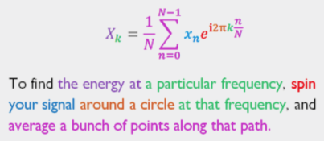

# Colorful Equations with MathJax

Stuart Riffle wrote up a great explanation of the Fourier transform. There are a number of great visualizations in his post, but the climax is his explanation of the inverse discrete Fourier transform formula:

What a brilliant representation! My first thought was that more equations should have such elegant explanations that focus on the comprehension of the reader. I’d love to be able to produce such clear explanations in this style:

$$\textcolor{Purple}{X}_\textcolor{Green}{k}
=\textcolor{Magenta}{\frac{1}{N}\sum_{n=0}^{N-1}}
\textcolor{Blue}{x_n}
\textcolor{Red}{e}^
{\textcolor{Red}{i}\textcolor{Orange}{2\pi} 
\textcolor{Green}{k}
\textcolor{Magenta}{\frac{n}{N}}
}.$$

**To find the energy at a particular frequency , spin your signal around a circle at that frequency, and average a bunch of points along that path.**

**Remark:**

1.  Html color setting Blue Brown Cyan Green Grey Magenta Orange Yellow Purple 
2.  The raw equation is $$X_k=\frac{1}{N}\sum_{n=0}^{N-1}x_ne^{i2\pi k \frac{n}{N}}.$$
3.  Reference: [Colorful Equations With MathJax](http://adereth.github.io/blog/2013/11/29/colorful-equations/)